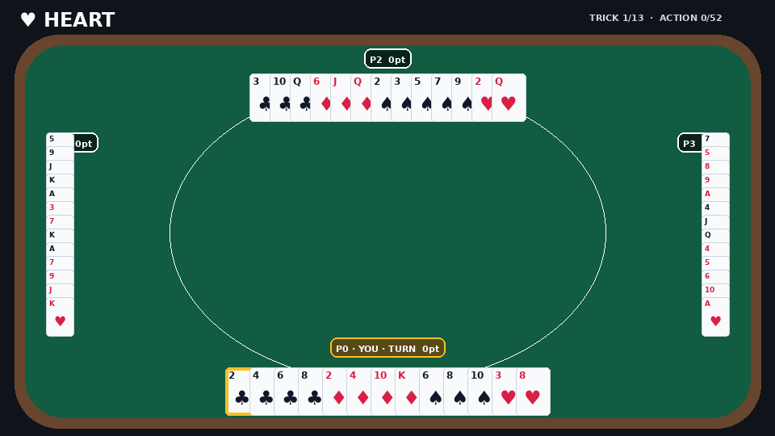

<div align="center">


# HEART

**An accelerator-native Hearts environment for competitive multi-agent reinforcement learning.**

[](LICENSE) [](https://www.python.org/) [](https://github.com/jax-ml/jax) [](#release-status) [](#release-status) [](CITATION.cff)

[Why HEART](#why-heart) · [Rules](#simplest-v0) · [Install](#installation) · [Quickstart](#quickstart) · [Batching](#batched-rollouts) · [Rendering](#rendering-and-replays) · [Contracts](#core-contracts) · [Documentation](#documentation)



<sub>HEART 0.1.0 · `simplest-v0` · seed 42 · four `medium` reference policies · 53 full-observability states rendered in approximately five seconds.</sub>

</div>

---

HEART is a compact JAX-native implementation of the card game Hearts for
multi-agent learning, evaluation, and reproducible simulation. The Python
distribution is `heart-marl`; the installed package is imported as `heart`.

Its fixed 52-action deal is designed to compose directly with `jax.jit`,
`jax.vmap`, and `jax.lax.scan`. Rules and state transitions remain in the lean
compiled path, while terminal/HTML rendering and replay generation remain
host-side.

> [!NOTE]
> HEART 0.1.0 is a research preview. No GitHub Release or PyPI package has been
> published yet, and the public API may evolve before a stable release.

## Why HEART

| Contract | What it provides |
| --- | --- |
| **Fixed horizon** | One deal always contains 52 card actions and 13 tricks, which makes batched rollouts straightforward. |
| **Pure JAX transition** | Immutable array state, explicit random keys, and no hidden environment mutation. |
| **Competitive rewards** | A terminal-only, zero-sum reward across four independent players. |
| **Legal-action masks** | A 52-way mask enforces the opening card, following suit, first-trick restrictions, and heart-leading rules. |
| **Reference opponents** | Seeded `easy`, `medium`, and `hard` rule policies share the learning-policy interface. |
| **Inspectable replays** | Full-observability terminal, HTML snapshot, and portable interactive replay outputs. |

Training algorithms are intentionally not bundled. HEART supplies the game
contract and reference policies; callers retain ownership of batching,
learning, evaluation, and experiment tracking.

## `simplest-v0`

`simplest-v0` is the only registered mode and the default returned by
`heart.make()`.

| Rule | Value |
| --- | --- |
| Players | 4 independent players |
| Deck | Standard 52-card deck, 13 cards per player |
| Episode length | Exactly 52 legal actions / 13 tricks |
| Passing phase | None |
| Opening lead | 2♣ |
| Following suit | Required when possible |
| Leading hearts | Forbidden until hearts are broken, unless only hearts remain |
| First trick | Point cards cannot be discarded when a non-point card is available |
| Heart penalty | 1 point each |
| Q♠ penalty | 5 points |
| Shooting the moon | Capturing all 18 points gives the shooter 0 and every opponent 18; the shooter wins alone |
| Reward timing | Zero before termination; one four-player reward vector after action 52 |

The lowest effective score wins. At termination, player `i` receives

```text
reward_i = mean(effective_scores_of_other_players) - effective_score_i
```

The four rewards sum to zero. For a moon shot they are `[+18, -6, -6, -6]`,
rotated to the shooter.

## Installation

Python 3.10, 3.11, and 3.12 are targeted. Until a formal release exists,
install from a checked-out revision:

```bash
git clone <repository-url> HEART
cd HEART
python -m pip install -e .
```

For development checks:

```bash
python -m pip install -e '.[dev]'
python -m pytest
```

JAX chooses CPU, GPU, or TPU from the installed runtime. Follow the
[JAX installation guide](https://docs.jax.dev/en/latest/installation.html) for
accelerator-specific wheels.

## Quickstart

```python
import jax

import heart

env = heart.make("simplest-v0")
policy = heart.make_rule_policy("medium")

key = jax.random.key(0)
key, reset_key = jax.random.split(key)
state, observation = env.reset(reset_key)

while not bool(state.terminated):
    key, action_key = jax.random.split(key)
    action = policy(observation, action_key)
    state, observation, rewards, terminated, info = env.step(state, action)

print("raw penalties:", state.penalties)
print("effective scores:", state.scores)
print("terminal rewards:", rewards)
```

An action is a card ID in `[0, 52)`. Invalid actions leave state unchanged,
return zero rewards, and set `info.invalid_action=True`; callers should treat
that result as a policy error.

## Batched rollouts

HEART does not introduce a separate vector-environment abstraction. Standard
JAX transformations batch the same authoritative transition:

```python
import jax
import jax.numpy as jnp

import heart

env = heart.make("simplest-v0")
keys = jax.random.split(jax.random.key(0), 4096)
batch_reset = jax.jit(jax.vmap(env.reset))
batch_step = jax.jit(jax.vmap(env.step))

states, observations = batch_reset(keys)
actions = jnp.argmax(observations.action_mask, axis=-1)
states, observations, rewards, terminated, infos = batch_step(states, actions)
```

Only the active player's action is supplied for each environment. See
[`benchmarks/random_rollout.py`](benchmarks/random_rollout.py) for a compiled
52-action throughput harness. Performance claims should report the source
revision, backend, hardware, batch size, warm-up, and measured run count.

## Core contracts

| Surface | Entry point | Boundary |
| --- | --- | --- |
| Environment | `heart.make`, `HeartEnv.reset`, `HeartEnv.step` | Stateless handle over immutable state and explicit PRNG keys |
| State and observation | [`docs/environment.md`](docs/environment.md) | Omniscient environment state versus player-private policy input |
| Rules and reward | [`docs/rules.md`](docs/rules.md) | Stable `simplest-v0` legality, scoring, termination, and reward semantics |
| Reference policies | `heart.make_rule_policy` | Mask-respecting, seeded baselines; not claims of optimal play |
| Rendering and replay | [`docs/rendering.md`](docs/rendering.md) | Full-observability host output, excluded from the compiled transition |
| Reproducibility | [`docs/reproducibility.md`](docs/reproducibility.md) | Explicit seeds, revision reporting, and benchmark receipts |

The learning observation is intentionally player-private. Full observability is
a **rendering contract**, not permission for a policy to access hidden opponent
hands.

## Built-in opponents

```python
policy = heart.make_rule_policy("medium")  # easy, medium, or hard
action = policy(observation, key)
```

- `easy` prefers low legal cards with randomized tie-breaking;
- `medium` tries to duck tricks and discard Q♠ or hearts when void;
- `hard` additionally reacts to a possible moon shooter and can pursue or
  disrupt a moon attempt using public information.

These are reproducible baselines, not optimal Hearts agents or measured human
models. New policies should remain isolated from the environment transition.

## Rendering and replays

Render one unbatched state as text or a standalone browser page:

```python
print(heart.render_ansi(state, viewer=0))
heart.save_html(state, "heart-game.html", viewer=0)
```

Create a compact animated preview with the optional rendering dependency:

```bash
python -m pip install -e '.[render]'
python examples/render_gif.py --output heart-preview.gif
```

Record the reset state and all 52 successor states to create an interactive
single-file replay:

```python
heart.save_replay_html(
    states,
    "heart-replay.html",
    viewer=0,
    fps=2.0,
)
```

HTML replays provide play/pause, frame stepping, a timeline, speed controls,
and keyboard navigation. Every hand is always visible. `viewer` only marks the
local player and rotates that seat to the bottom; `viewer=None` selects a
neutral spectator orientation.

```bash
python examples/render_replay.py --output heart-replay.html --difficulty medium
```

Generated HTML files do not belong in source control. See the
[rendering contract](docs/rendering.md).

## Release status

| Surface | Current state |
| --- | --- |
| Version | `0.1.0` |
| Environment IDs | `simplest-v0` |
| Source status | Research preview |
| GitHub tag and Release | Not published |
| PyPI package | Not published |
| CI | Workflow included; public run pending push |
| API stability | Pre-1.0; incompatible changes require changelog entries |

A formal release exists only when one validated source commit, an annotated
tag, a GitHub Release, and built distributions identify the same code. See
[`docs/release.md`](docs/release.md).

## Documentation

| Area | Document |
| --- | --- |
| Documentation map | [`docs/README.md`](docs/README.md) |
| State, observations, actions, and transitions | [`docs/environment.md`](docs/environment.md) |
| `simplest-v0` rules and rewards | [`docs/rules.md`](docs/rules.md) |
| Full-observability rendering and replay | [`docs/rendering.md`](docs/rendering.md) |
| Seeds, batching, and performance evidence | [`docs/reproducibility.md`](docs/reproducibility.md) |
| Release and compatibility policy | [`docs/release.md`](docs/release.md) |

## Contributing and security

Issues and pull requests are welcome. Reproducible bug reports should include
the HEART and JAX versions, source revision, backend, mode, seed, and smallest
failing action sequence.

See [CONTRIBUTING.md](CONTRIBUTING.md),
[CODE_OF_CONDUCT.md](CODE_OF_CONDUCT.md), and [SECURITY.md](SECURITY.md).

## Citation

For this research preview, cite the exact commit used together with
[CITATION.cff](CITATION.cff).

```bibtex
@software{park_heart_2026,
  author    = {Park, Hyunwoo},
  title     = {HEART: An Accelerator-Native Hearts Environment for Competitive Multi-Agent Reinforcement Learning},
  year      = {2026},
  license   = {Apache-2.0},
  note      = {Research-preview source; cite the exact Git commit used}
}
```

## License

Licensed under the [Apache License 2.0](LICENSE). Copyright © 2026 Hyunwoo
Park. Developed at CIDA Lab, University of Seoul. See [NOTICE](NOTICE) for
attribution.
